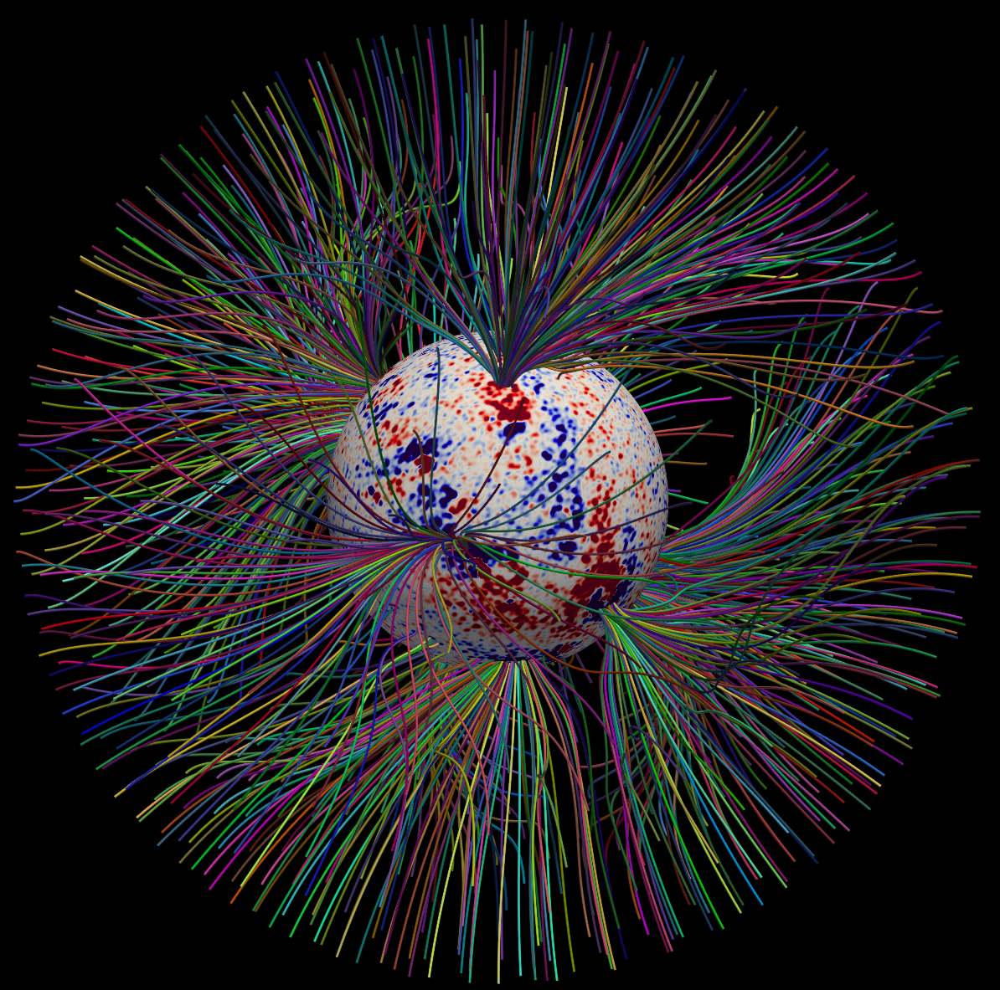

 
  
# POT3D: High Performance Potential Field Solver 
[Predictive Science Inc.](https://www.predsci.com)  
  
## OVERVIEW  
  
POT3D is a Fortran code that computes potential field solutions to approximate the solar coronal magnetic field using observed photospheric magnetic fields as a boundary condition.  It can be used to generate potential field source surface (PFSS), potential field current sheet (PFCS), and open field (OF) models. It has been (and continues to be) used for numerous studies of coronal structure and dynamics.  The code is highly parallelized using [MPI](https://www.mpi-forum.org) and is GPU-accelerated using Fortran standard parallelism (do concurrent) and [OpenMP Target](https://www.openmp.org/) for data movement and device selection, along with an option to use the [NVIDIA cuSparse library](https://developer.nvidia.com/cusparse). The [HDF5](https://www.hdfgroup.org/solutions/hdf5) file format is used for input/output.
  
POT3D is the potential field solver for the WSA/DCHB model in the CORHEL software suite publicly  
hosted at the [Community Coordinated Modeling Center (CCMC)](https://ccmc.gsfc.nasa.gov/models/modelinfo.php?model=CORHEL/MAS/WSA/ENLIL).  
A version of POT3D that includes GPU-acceleration with both MPI+[OpenACC](https://www.openacc.org) and MPI+OpenMP  
was released as part of the Standard Performance Evaluation Corporation's (SPEC) [SPEChpc(TM) 2021 benchmark suite](https://www.spec.org/hpc2021).  
POT3D is also included in the [SPEC CPU(TM) 2026 benchmark suite](https://www.spec.org/cpu2026).
  
Details of the code can be found in these publications:  
  
 - *Variations in Finite Difference Potential Fields*.  
 Caplan, R.M., Downs, C., Linker, J.A., and Mikic, Z.  [Ap.J. 915,1 44 (2021)](https://iopscience.iop.org/article/10.3847/1538-4357/abfd2f)
 - *From MPI to MPI+OpenACC: Conversion of a legacy FORTRAN PCG solver for the spherical Laplace equation*.  
 Caplan, R.M., Mikic, Z., and Linker, J.L.  [arXiv:1709.01126](https://arxiv.org/abs/1709.01126) (2017)
  
--------------------------------
  
## HOW TO BUILD POT3D 
  
The included `build.sh` script will use a configuration file to generate a Makefile and build the code.  
The folder `conf` contains example configuration files for various compilers and systems.  
We recommend copying the configuration file closest to your setup and then  
modifying it to conform to your compiler and system.  
  
Given a configure script `conf/my_custom_build.conf`, the build script is invoked as:  
```
> ./build.sh ./conf/my_custom_build.conf
```
    
### Validate Installation 
  
After building the code, it can be tested by running the testsuite.  
Enter the `testsuite` directory and run:  
`./run_test_suite.sh -np=<N>`  
where "<N>" is the number of MPI ranks to use.  
To see available options, run `run_test_suite.sh -h`  

--------------------------------
  
## HOW TO USE POT3D  
  
### Setting Input Options
  
POT3D uses a namelist in an input text file called `pot3d.dat` to set all parameters of a run.  See the provided `pot3d_input_documentation.txt` file for details on the various parameter options.  For any run, an input 2D data set in HDF5 format is required for the lower radial magnetic field (`Br`) boundary condition.  Examples of this file are contained in the `benchmarks` and `testsuite` folders.
  
### Launching the Code 
  
To run `POT3D`, set the desired run parameters in a `pot3d.dat` text file, then copy or link the `pot3d` executable into the same directory as `pot3d.dat` and run the command:  
  `<MPI_LAUNCHER> -np <N> ./pot3d `  
where `<N>` is the total number of MPI ranks to use (typically equal to the number of CPU cores or number of GPUs) and `<MPI_LAUNCHER>` is your MPI run command (e.g. `mpiexec`,`mpirun`, `ibrun`, `srun`, etc).  
For example:  `mpiexec -np 1024 ./pot3d`

### Solver Options  

POT3D uses a preconditoned Conjugate Gradient solver with two preconditioner options:  
1) `ifprec=1`: Diagonal scaling.
2) `ifprec=2`: Non-overlapping ILU0  
Typically, using `ifprec=2` will run POT3D faster than `ifprec=1`, but use more memory.
For NVIDIA GPUs,  `ifprec=2` requires building the code with the `cuSparse` library.  
For Intel and AMD GPUs, only `ifprec=1` is currently available.  
POT3D will auto-detect how it is being built, and may override `ifprec` to the option best suited for the current build.
    
### Running POT3D on GPUs 
  
For standard cases, one should launch the code such that the number of MPI ranks per node is equal to the number of GPUs per node  
e.g.  
`mpiexec -np <N> --ntasks-per-node 4 ./pot3d`  
  
For Intel GPUs, one must set the following ENV variable before running:  
`export I_MPI_OFFLOAD=1`   
    
### Memory Requirements  
  
To estimate how much memory (RAM) is needed for a run (using `ifprec=1`), compute:  
  
`memory-needed = nr*nt*np*8*13.6/1000/1000/1000 GB`  
  
where `nr`, `nt`, and `np` are the chosen problem sizes in the `r`, `theta`, and `phi` dimension.  
  
If using `ifprec=2`, the required memory can be two to four times higher.
  
### Solution Output 
  
Depending on the input parameters, `POT3D` can have various outputs. Typically, the three components of the potential magnetic field is output as `HDF5` files. In every run, the following two text files are output:

 - `pot3d.out`      An output log showing grid information and magnetic energy diagnostics.
 - `timing.out`     Time profile information of the run.
  
### Helpful Scripts 
  
Some useful python scripts for reading and plotting the POT3D input data, and reading the output data can be found in the  `bin` folder.  
  
-----------------------------
  
## BENCHMARKS AND TESTSUITE
  
### Benchmarks 
  
In the `benchmarks` folder, we provide two run cases that can be used to benchmark the performance of `POT3D`.  

The following is a list of the included benchmark runs, their problem size, and their memory requirements:

1. **`bench_tiny`**  (Equivalent to SPEChpc(TM)2021's "tiny" run)  
Grid size:  173x361x1171 =  73.2 million cells  
Memory (RAM) needed (using `ifprec=1`):   ~7.96 GB
2. **`isc2023`**  (Equivalent to SPEChpc(TM)2021's "small" run) 
Grid size:  325x450x2050 = 299.8 million cells   
Memory (RAM) needed (using `ifprec=1`):  ~32.62 GB  
 

### Testsuite 

In the `testsuite` folder, we provide the following example runs of `POT3D`:

1. **`/potential_field_source_surface`**  
A standard PFSS run with a source surface radii of 2.5 Rs.
2. **`/potential_field_current_sheet`**  
A standard PFCS run using the outer boundary of the PFSS example as its inner boundary condition, with a domain that extends to 30 Rs. The magnetic field solution produced is unsigned.  
3. **`/open_field`**  
An example of computing the "open field" model from the solar surface out to 20 Rs using the same input surface Br as the PFSS example. The magnetic field solution produced is unsigned. 

Each test case contains an `input` folder with the run input files, a `run` folder used to run the test, and a `reference` folder containing the output diagnostics used to validate the test.  
The validation is done with the magnetic energy diagnostics in the `pot3d.out` file.  
All tests run with `ifprec=1` by default - use the `-pc=2` option to run with `ifprec=2`.  
  
To run the testsuite, use the included script `run_test_suite.sh`
To see available options, run `run_test_suite.sh -h`  


